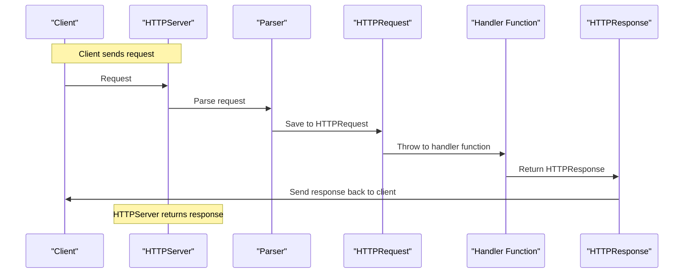

CServe is a web server written in C. Inspired from nginx, and started with a huge motivation to learn network programming and system-level thinking. The project is divided into chapters, each of which focuses on a specific feature or technique. The chapters are ordered by difficulty level, starting with the basics and gradually increasing in complexity.  

!!! note
    This document shows the 1st phase of the project implementation (April 13 - June 8). The 0.2.0 version is in progress...

---

The overall plan was as follows:  


### 0️⃣ Basic TCP Server
**Goal**  
Create a foundation that listens for and accepts TCP connections, setting up the socket infrastructure for later HTTP functionality. 

**Implementation**  
Use a `Server` struct to store socket configuration. Implement `server_constructor` to initialize the struct, create a socket with `socket()`, bind it to a port using `bind()` and start listening with `listen()`. Don't forget to set the `S0_REUSEADDR` option to avoid "address already in use" errors.
Create a `launch()` function that runs an infinite loop, calling `accept()` to handle incoming connections and logging each connection.


### 1️⃣ Basic HTTP Server
**Goal**  
Extend the TCP server to parse HTTP requests and respond with a static HTTP response, introducing HTTP protocol handling.

**Implementation**  
Define an `HTTPRequest` struct to store parsed request data:
- `method`, `path` and `version`
- `Headers`
- `header_count`
- `Body`
- `body_length`

Implement `http_request_parser` to read the request from a client socket, tokenize the request line, and parse headers until an empty line (`\r\n`).
Create an `HTTPResponse` struct for responses.

**Best Practices**  
- Allocate memory dynamically for `HTTPRequest` fields and free them with `http_request_free` to prevent leaks. 
- Test with curl http://localhost:8080 to verify the response. 
- Use Valgrind to check for memory leaks in `http_request_parse`.


### 2️⃣ Static File Serving
**Goal**  
Serve static files (e.g., HTML, CSS, images) from a directory, adding a key Nginx feature.

**Implementation**  
Introduce an `HTTPServer` struct to manage HTTP-specific state: a reference to the `Server` struct, a `static_dir` path, and a `handler` function pointer for processing requests. The constructor should also initialize `static_dir`.

**Best Practices**  
- Allocate a buffer for file contents dynamically based on file size.
- Test with a browser to verify files (e.g., index.html, images) are served correctly.
- Log file access errors (e.g., “File not found”) to debug issues.
- Hardcode common `Content-Type` values (e.g., `text/html` for .html, `image/png` for .png) in a lookup table, deferring MIME type detection libraries.
- Check for path traversal attacks (e.g., `../../etc/passwd`) by validating the resolved path stays within `static_dir`.

### 3️⃣ Reverse Proxy
**Goal**  
Forward HTTP requests to a backend server, let's say FastAPI app on Uvicorn, enabling the server to act as a reverse proxy. Relay the backend’s response back to the client.

**Implementation**  
Extend `HTTPServer` to include a `proxy_backends` array, which includes strings like `“localhost:8000”` and `backend_count`. Implement `proxy_request` to:
- Create a new socket to connect to the backend using `socket()` and `connect()`.
- Reconstruct the client’s HTTP request (method, path, headers) and send it to the backend.
- Read the backend’s response and forward it to the client.

Update the handler function in `HTTPServer` to decide whether to serve a static file or proxy based on the request path (e.g., proxy `/api/*` to the backend, serve `/static/*` from disk).

**Best Practices**  
- Handle connection failures (e.g., backend down) by returning a `502 Bad Gateway` response.
- Test with a Python FastAPI app running on `localhost:8000` and `curl` to verify proxying.
- Use `strace` to debug socket issues between the server and backend.

### 4️⃣ Load Balancing
**Goal**  
Distribute requests across multiple backends to improve scalability, adding load balancing to the reverse proxy. Support multiple backend servers (e.g., `localhost:8000`, `localhost:8001`). Implement a **round-robin algorithm** to distribute requests evenly.

**Implementation**  
Define a `Backend` struct with host (e.g., `“localhost”`) and port (e.g., `8000`). Store backends in `HTTPServer`’s `proxy_backends` as an array of strings, parsed into `Backend` structs at runtime. Implement `choose_backend` to select the next backend in a round-robin fashion, tracking the current index with a static variable. Modify `proxy_request` to use the selected backend’s host and port. Update `handler` to call `choose_backend` for proxied requests.

**Best Practices**  
- Log which backend handles each request to verify distribution.
- Test with multiple FastAPI instances (e.g., on ports `8000` and `8001`) and `wrk` to simulate load.
- Assume backends are always available, adding health checks in a future iteration if needed.


### 5️⃣ Config File (.ini)
**Goal**  
Add a configuration file to make the server flexible, allowing users to specify the port, static directory, and backends without recompiling. Parse a simple `.ini` configuration file to set server parameters. Use the parsed values to initialize the `Server` and `HTTPServer` structs.

**Implementation**  
Define a config file format like:
```ini
port=8080
static_dir=./static
backend=localhost:8000
backend=localhost:8001
```
Implement `parse_config` to read the file line by line, extracting key-value pairs (e.g., `port`, `static_dir`, `backend`). Then store parsed backends in a dynamic array for `HTTPServer`. Update `main` to call `parse_config` and pass the results to `server_constructor` and `http_server_constructor`.

**Best Practices**  
- Validate config values (e.g., port range, valid directory) to prevent crashes.
- Provide default values (e.g., port `8080`) if the config file is missing.
- Test with different config files to ensure flexibility.


### 6️⃣ Concurrency (Event-based)
**Goal**  
Enable the server to handle multiple clients concurrently using an event-based model, improving performance and scalability.
- Replace the single-threaded `accept()` loop with an event-driven model to handle multiple connections simultaneously. That way, process client requests (parsing, static files, proxying) without blocking other clients.

**Implementation**  
Use `select()` (then `epoll()` later on) to monitor multiple sockets for events.
Modify `launch()` to:
- Initialize a `fd_set` for `select`.
- Accept new connections and add client sockets to the set.
- Read and process requests from ready sockets, calling handler for HTTP logic.
- Close sockets after processing to free resources.

Maintain a dynamic array or list of active client sockets in HTTPServer to track state.

**Best Practices**  
- Limit the number of concurrent connections (e.g., `1024`) to avoid `select`’s file descriptor limit.
- Test with `wrk` to measure throughput under load (e.g., 100 concurrent clients).
- Use `Valgrind` to ensure no memory leaks in the event loop.
- Stick to a single thread to avoid threading complexity, mimicking Nginx’s event-driven model.


---


### 🧰 Toolkit

- [Valgrind](https://valgrind.org/docs/manual/quick-start.html) for memory leak checks
- **GDB** debugger to debug runtime issues
- [Check](https://libcheck.github.io/check/) framework for Unit Testing
- [wrk](https://github.com/wg/wrk) for modern benchmarking
- Custom logging and tracing


---


## Journey

This is my (short) written story of how I built (at least initialized) the 1st version of the nginx clone.

### Day 1 - Apr 17, 2025

> The journey begins. I was so motivated. I had a reference video on building a HTTP server. I was thinking I know C well still, but...

Well, the day really confused me. First, I watched several videos of Eric Meehan's playlist, however then realized he is not building what I was looking for. Plus, the implementation were a bit complex - the usage of linkedlist with binary search tree to parse HTTP, that's overkill. As it's not enough, I forgot to work with pointers in C🤦‍♂️. What the... Thanks to Beej's Guide to C book, which helped me to refresh my knowledge quickly (on a bus:).

So, I decided not to rush. The initial thing was to make clear - **what I want to build?** Gunicorn-like Python web server? Or Nginx like web server? What differentiates them? 
Such questions really made me stuck and demotivated. But then I forgot about everything and restarted to think from scratch. Researched a bit and found that I'm building NGINX-like web server!

Great, as now I have a clear vision, the only thing needed was a solid plan with toolkit. My plan became version-based:
**- V0. Basic TCP Server**
**- V1. Basic HTTP Server**
**- V2. Static File Serving**
**- V3. Reverse Proxy**
**- V4. Load Balancing**
**- V5. Config File (.ini)**
**- V6. Concurrency (Event-based)**

I knew that it is not simply writing code at night, I also should analyze every corner, test the code, benchmark it and use best practices. So, I made a toolkit for me too:
- [Valgrind](https://valgrind.org/docs/manual/quick-start.html) for memory leak checks
- **GDB** debugger to debug runtime issues
- [Check](https://libcheck.github.io/check/) framework for Unit Testing
- [wrk](https://github.com/wg/wrk) for modern benchmarking
- Custom logging and tracing

> The whole day spent to build a solid plan. Well, let's move onto Day 2!


### Day 2 - April 18, 2025

Finally, today I completed my solid plan through a version-based approach, with the help of Grok. Yes, I used AI :).

> There was a simple introductory TCP server implementation, written while I was watching Eric Meehan's video series. I let it stay for now, and started building my own `Vector`, as I use it a lot.

I expected it to be easy, but... I forgot many things, that's the effect of working in Python only in last months definitely. So, I decided to start from scratch.

**Building Vector: Trial 1**  
Here, I simply defined a struct with `data`, `length` and `capacity` fields, data holding only integers. Certainly for simplicity. Before making everything complex, I tried implementing `append()`, `insert()`, `pop()` and similar methods using function pointers. I wrote very basic implementations for each, not checking for edge cases even. Because I first wanted to setup Test framework and valgrind to start using.
Check framework worked as expected, I wrote a sample test and ran. Valgrind, as always, showed that I'm leaking memory of `4n` bytes while mallocing the dynamic array initialization.
Then I changed my file structure, added future `rust-server` README and wrote appropriate `Makefile`. This took the day 2.


### Day 3 - April 19, 2025

**Building a Vector: Trial 2**  
That day, I tried again implementing my own Vector. I wrote several methods, which in turn nothing worked. I even tried freeing a memory block which was never malloced! 

However I finished basic TCP server implementation at least. Refactored `.launch()` method so that starts the server istance.

I defined very initial definitions of HTTPServer struct, preparing for actual implementation.


### Day 4 - April 21, 2025

**Building a Vector: Trial 3**  
Finally finished the dynamic array implementation. All of the methods worked, tested in `main.py` file manually. Checked for memory leaks using valgrind - everything is fine so far.

I started using a debugger, using VSCode's `launch.json` settings. That was also a huge advantage as I determined several pitfalls using debugging.


### Day 5 - April 23, 2025

Finally, we came into parsing the actual HTTP request. I have several options for tokenizing the request, including `strtok()`, `strchr()`. We'll try to benefit from both. [01:34]

The general HTTP request format is:

```
GET /index.html HTTP/1.1
Host: example.com
User-Agent: Mozilla/5.0 (X11; Linux x86_64; rv:52.0) Gecko/20100101 Firefox/52.0
Accept: text/html,application/json
Accept-Language: en-US,en;q=0.5
Accept-Encoding: gzip, deflate

{
    "username": "admin",
    "password": "password"
}
```

We can see the request consists of 3 main parts:

1. The request line
2. The headers
3. The body [17:05]

So, we write separate parsers for each, and then glue them together in a final `parse_http_request()` function. Before that, I had to make sure `strtok()` and `strchr()` can help me. Hence, I tested the following, ensuring `strtok()` can tokenize the overall request into lines, so that I can parse further:
```c
char teststr[500] =
        "GET /index.html HTTP/1.1\r\n"
        "Host: example.com\r\n"
        "User-Agent: Mozilla/5.0 (X11; Linux x86_64; rv:52.0) Gecko/20100101 Firefox/52.0\r\n"
        "Accept: text/html,application/json\r\n"
        "Accept-Language: en-US,en;q=0.5\r\n"
        "Accept-Encoding: gzip, deflate\r\n";
char *tokptr = strtok(teststr, "\r\n");

while (tokptr != NULL)
{
    printf("%s\n", tokptr);
    tokptr = strtok(NULL, "\r\n");
}
```

The again tested to parse the request line itself with `strtok()`:
```c
char teststr[100] = "GET /index.html HTTP/1.1";
char *tokptr      = strtok(teststr, " ");

while (tokptr != NULL)
{
    printf("%s\n", tokptr);
    tokptr = strtok(NULL, " ");
}
```

Great. As I expected. So, I continued implementing my HTTP request parser like this, by separating each 3 parts into separate functions:

```c
HTTPServer *parse_http_request(HTTPServer *httpserver_ptr, char *request)
{
    char *token = strtok(request, "\r\n");

    // 1. Request Line
    parse_request_line(httpserver_ptr, token);
    token = strtok(NULL, "\r\n");

    // 2. Headers
    parse_headers(httpserver_ptr, token);
    token = strtok(NULL, "\r\n");

    // 3. Body
    parse_body(httpserver_ptr, token);

    return httpserver_ptr;
}
```

So, my initial implementation for parsing request line became as follows:
```c
HTTPServer *parse_request_line(HTTPServer *httpserver_ptr, char *request_line)
{
    char *method  = (char *)malloc(10 * sizeof(char));
    char *path    = (char *)malloc(100 * sizeof(char));
    char *version = (char *)malloc(10 * sizeof(char));

    // 1. HTTP request type
    char *token = strtok(request_line, " ");
    strcpy(method, token);

    // 2. HTTP request path (we need splits again)
    token = strtok(NULL, " ");
    strcpy(path, token);
    // parse_request_path(httpserver, token);

    // 3. HTTP version
    token = strtok(NULL, " ");
    strcpy(version, token);

    printf("Request Line:\n%s %s %s\n", method, path, version);

    httpserver_ptr->request[0] = method;
    httpserver_ptr->request[1] = path;
    httpserver_ptr->request[2] = version;

    return httpserver_ptr;
}
```

And it worked, according to my manual tests. But...

**Design Issue.** I sensed a huge mistake here. Why am I saving all of the request data right in the HTTPServer struct fields? How does it make sense? Each incoming request should be HTTPRequest construct and every response should be HTTPResponse construct. Okay for blocking connections with `while` loop and `accept()`, but the flow should still continue correctly. Ahh... [00:47]


### Day 6 - April 24, 2025

> Okay, let's plan first. 

Here is the [mermaid](https://mermaid.liveedit.me/) diagram of the process:



So, it is much clear right now that we messed up HTTPServer and HTTPRequest stages previously. Right now we have to fix this first.

1. Define `HTTPRequest` struct
2. Refactor `HTTPServer` struct
3. Refactor `parse_http_request()`
4. Add memory safety best-practices:
    - centralized alloc-dealloc
    - signal handlers and standard error message codes

---

Unfortunately, after this point we stopped writing daily journey.