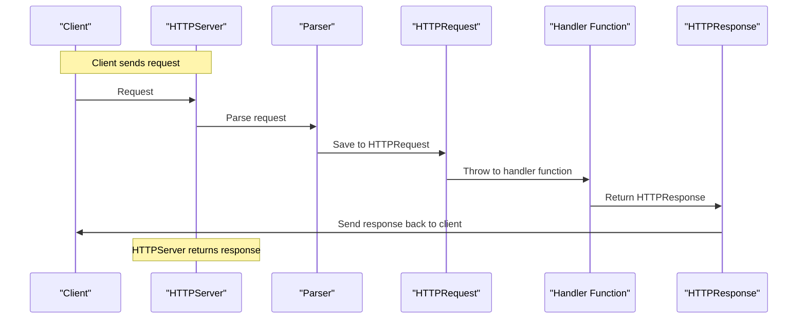

# Cserve - Journey

This is my (short) written story of how I built (at least initialized) the 1st version of the nginx clone.

### Day 1 - Apr 17, 2025

> The journey begins. I was so motivated. I had a reference video on building a HTTP server. I was thinking I know C well still, but...

Well, the day really confused me. First, I watched several videos of Eric Meehan's playlist, however then realized he is not building what I was looking for. Plus, the implementation were a bit complex - the usage of linkedlist with binary search tree to parse HTTP, that's overkill. As it's not enough, I forgot to work with pointers in C🤦‍♂️. What the... Thanks to Beej's Guide to C book, which helped me to refresh my knowledge quickly (on a bus:).

So, I decided not to rush. The initial thing was to make clear - **what I want to build?** Gunicorn-like Python web server? Or Nginx like web server? What differentiates them? 
Such questions really made me stuck and demotivated. But then I forgot about everything and restarted to think from scratch. Researched a bit and found that I'm building NGINX-like web server!

Great, as now I have a clear vision, the only thing needed was a solid plan with toolkit. My plan became version-based:
**- V0. Basic TCP Server**
**- V1. Basic HTTP Server**
**- V2. Static File Serving**
**- V3. Reverse Proxy**
**- V4. Load Balancing**
**- V5. Config File (.ini)**
**- V6. Concurrency (Event-based)**

I knew that it is not simply writing code at night, I also should analyze every corner, test the code, benchmark it and use best practices. So, I made a toolkit for me too:
- [Valgrind](https://valgrind.org/docs/manual/quick-start.html) for memory leak checks
- **GDB** debugger to debug runtime issues
- [Check](https://libcheck.github.io/check/) framework for Unit Testing
- [wrk](https://github.com/wg/wrk) for modern benchmarking
- Custom logging and tracing

> The whole day spent to build a solid plan. Well, let's move onto Day 2!


### Day 2 - April 18, 2025

Finally, today I completed my solid plan through a version-based approach, with the help of Grok. Yes, I used AI :).

> There was a simple introductory TCP server implementation, written while I was watching Eric Meehan's video series. I let it stay for now, and started building my own `Vector`, as I use it a lot.

I expected it to be easy, but... I forgot many things, that's the effect of working in Python only in last months definitely. So, I decided to start from scratch.

**Building Vector: Trial 1**  
Here, I simply defined a struct with `data`, `length` and `capacity` fields, data holding only integers. Certainly for simplicity. Before making everything complex, I tried implementing `append()`, `insert()`, `pop()` and similar methods using function pointers. I wrote very basic implementations for each, not checking for edge cases even. Because I first wanted to setup Test framework and valgrind to start using.
Check framework worked as expected, I wrote a sample test and ran. Valgrind, as always, showed that I'm leaking memory of `4n` bytes while mallocing the dynamic array initialization.
Then I changed my file structure, added future `rust-server` README and wrote appropriate `Makefile`. This took the day 2.


### Day 3 - April 19, 2025

**Building a Vector: Trial 2**  
That day, I tried again implementing my own Vector. I wrote several methods, which in turn nothing worked. I even tried freeing a memory block which was never malloced! 

However I finished basic TCP server implementation at least. Refactored `.launch()` method so that starts the server istance.

I defined very initial definitions of HTTPServer struct, preparing for actual implementation.


### Day 4 - April 21, 2025

**Building a Vector: Trial 3**  
Finally finished the dynamic array implementation. All of the methods worked, tested in `main.py` file manually. Checked for memory leaks using valgrind - everything is fine so far.

I started using a debugger, using VSCode's `launch.json` settings. That was also a huge advantage as I determined several pitfalls using debugging.


### Day 5 - April 23, 2025

Finally, we came into parsing the actual HTTP request. I have several options for tokenizing the request, including `strtok()`, `strchr()`. We'll try to benefit from both. [01:34]

The general HTTP request format is:

```
GET /index.html HTTP/1.1
Host: example.com
User-Agent: Mozilla/5.0 (X11; Linux x86_64; rv:52.0) Gecko/20100101 Firefox/52.0
Accept: text/html,application/json
Accept-Language: en-US,en;q=0.5
Accept-Encoding: gzip, deflate

{
    "username": "admin",
    "password": "password"
}
```

We can see the request consists of 3 main parts:

1. The request line
2. The headers
3. The body [17:05]

So, we write separate parsers for each, and then glue them together in a final `parse_http_request()` function. Before that, I had to make sure `strtok()` and `strchr()` can help me. Hence, I tested the following, ensuring `strtok()` can tokenize the overall request into lines, so that I can parse further:
```c
char teststr[500] =
        "GET /index.html HTTP/1.1\r\n"
        "Host: example.com\r\n"
        "User-Agent: Mozilla/5.0 (X11; Linux x86_64; rv:52.0) Gecko/20100101 Firefox/52.0\r\n"
        "Accept: text/html,application/json\r\n"
        "Accept-Language: en-US,en;q=0.5\r\n"
        "Accept-Encoding: gzip, deflate\r\n";
char *tokptr = strtok(teststr, "\r\n");

while (tokptr != NULL)
{
    printf("%s\n", tokptr);
    tokptr = strtok(NULL, "\r\n");
}
```

The again tested to parse the request line itself with `strtok()`:
```c
char teststr[100] = "GET /index.html HTTP/1.1";
char *tokptr      = strtok(teststr, " ");

while (tokptr != NULL)
{
    printf("%s\n", tokptr);
    tokptr = strtok(NULL, " ");
}
```

Great. As I expected. So, I continued implementing my HTTP request parser like this, by separating each 3 parts into separate functions:

```c
HTTPServer *parse_http_request(HTTPServer *httpserver_ptr, char *request)
{
    char *token = strtok(request, "\r\n");

    // 1. Request Line
    parse_request_line(httpserver_ptr, token);
    token = strtok(NULL, "\r\n");

    // 2. Headers
    parse_headers(httpserver_ptr, token);
    token = strtok(NULL, "\r\n");

    // 3. Body
    parse_body(httpserver_ptr, token);

    return httpserver_ptr;
}
```

So, my initial implementation for parsing request line became as follows:
```c
HTTPServer *parse_request_line(HTTPServer *httpserver_ptr, char *request_line)
{
    char *method  = (char *)malloc(10 * sizeof(char));
    char *path    = (char *)malloc(100 * sizeof(char));
    char *version = (char *)malloc(10 * sizeof(char));

    // 1. HTTP request type
    char *token = strtok(request_line, " ");
    strcpy(method, token);

    // 2. HTTP request path (we need splits again)
    token = strtok(NULL, " ");
    strcpy(path, token);
    // parse_request_path(httpserver, token);

    // 3. HTTP version
    token = strtok(NULL, " ");
    strcpy(version, token);

    printf("Request Line:\n%s %s %s\n", method, path, version);

    httpserver_ptr->request[0] = method;
    httpserver_ptr->request[1] = path;
    httpserver_ptr->request[2] = version;

    return httpserver_ptr;
}
```

And it worked, according to my manual tests. But...

**Design Issue.** I sensed a huge mistake here. Why am I saving all of the request data right in the HTTPServer struct fields? How does it make sense? Each incoming request should be HTTPRequest construct and every response should be HTTPResponse construct. Okay for blocking connections with `while` loop and `accept()`, but the flow should still continue correctly. Ahh... [00:47]


### Day 6 - April 24, 2025

> Okay, let's plan first. 

Here is the [mermaid](https://mermaid.liveedit.me/) diagram of the process:



So, it is much clear right now that we messed up HTTPServer and HTTPRequest stages previously. Right now we have to fix this first.

1. Define `HTTPRequest` struct
2. Refactor `HTTPServer` struct
3. Refactor `parse_http_request()`
4. Add memory safety best-practices:
    - centralized alloc-dealloc
    - signal handlers and standard error message codes

So, we know our next steps, let's start. [00:59]
